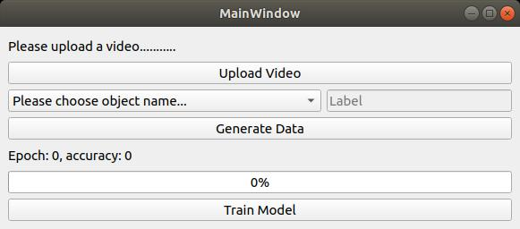
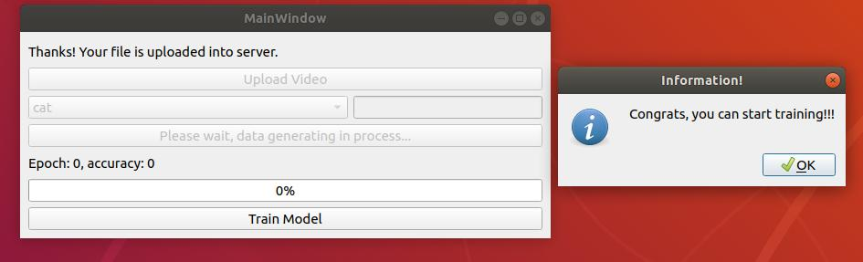
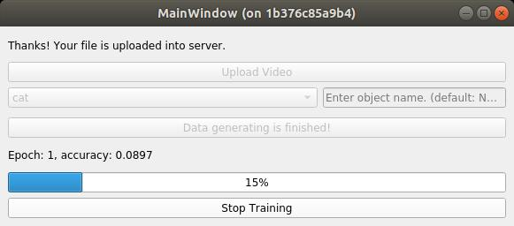

### Magic
<div style="text-align: justify">
The project designed for simplifying training process as much as possible. We have used SOTA tracking and object detection models
for automatic labeling. </div>
### Environments
1. Ubuntu 16.04/18.04
2. python > = 3.6
3. opencv >= 3.4
4. pyqt5
5. caffe-ssd (gpu version preferably)

### Installation
1. Load the source of Magic project
```Shell
git-lfs clone https://github.com/simshineaicamera/magic.git
cd magic
```
*Note please use git-lfs, because yolov3 model is large, can't be downloaded without git-lfs*
2. Install python package requirments:
```Shell
python3.6 -m pip install -r requirments.txt
```
3. If you have already installed [SIMCAM_SDK](https://github.com/simshineaicamera/SIMCAM_SDK) you can skip this step.
<br> Compile [caffe-ssd](https://github.com/weiliu89/caffe/tree/ssd) on your system and set `PYTHONPATH` into your system path

### Installation with Docker
1. The most easiest way to install the tool is using docker. Run following commands to upload and run the docker image
```Shell
sudo docker run -it \
    -v /tmp/.X11-unix:/tmp/.X11-unix \
    -e DISPLAY=$DISPLAY \
    --privileged \
    simcam/magic:v1.0 bash
cd /home/Magic
```

### How to use

1. Run the `run.sh` script
```Shell
./run.sh
```
You will see GUI for auto labeling and training your own model


2. Let's say, you are going train your own cat detection model, press `Upload Video` button to upload a video , and please make sure that video contains desired object (in this case cat)
3. Choose object name <br>
*Note, you can choose `Other` class as well, and give a label for the object for example `mycat`. In this option, the program use `tracking` method for automatic labeling*
4. Press `Generate Data` button to generate data for training.
5. Data generating process takes 10-15 mins depends on your system CPU and GPU capability. After generating data, you will see message as below.
   

6. Press `Train Model` button to start training the model.
Training speed depends on your system capability (CPU and GPU). You can see training process on the screen , epoch and accuracy.
 

 You can stop training process early if you think accuracy of the model is enough. From the experiments, if model accuracy is higher than 0.86 value, you can test the model for deploy.


### References

1. [Caffe-SSD](https://github.com/weiliu89/caffe/tree/ssd)
2. [MobileNet-SSD](https://github.com/chuanqi305/MobileNet-SSD)
3. [SiamMask](https://github.com/foolwood/SiamMask)
4. [MobileNet-YOLO](https://github.com/eric612/MobileNet-YOLO)
5. [Yolov3](https://github.com/heartkilla/yolo-v3)
